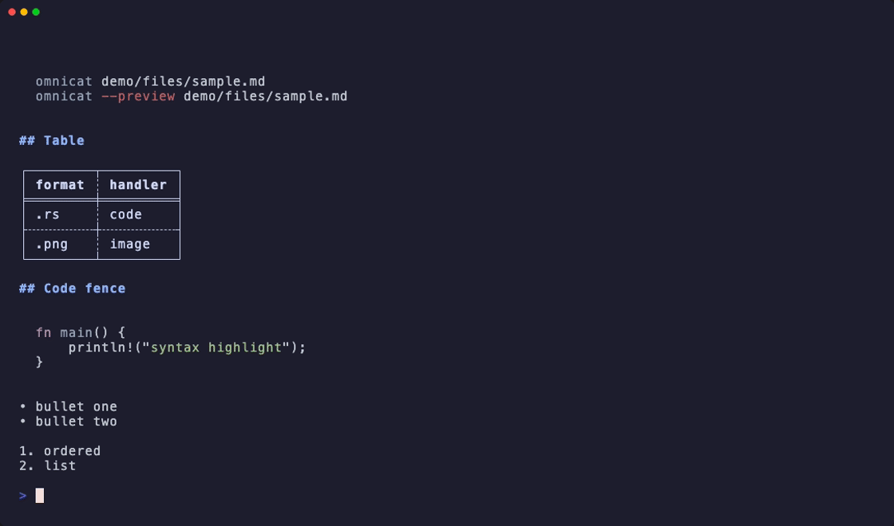

# Demo fixtures for omnicat

Sample files for manual testing of terminal preview and `--preview` GUI.

## Demo GIF



Shows markdown, code, CSV, `db --query`, `log --stats`, directory tree, and `--status`. Commands are recorded hidden so the GIF focuses on output.

Tape uses `echo` for section labels (bare `#` lines are shell comments in zsh). Terminal code theme defaults to `auto`, which detects the terminal background and picks a readable theme (dark or light).

Re-record (requires [VHS](https://github.com/charmbracelet/vhs)):

```bash
cargo build --release
brew install vhs   # once
vhs demo/omnicat-demo.tape
```

## Generate binaries

Text fixtures are committed as-is. Office archives, images, SQLite, etc. are produced by:

```bash
chmod +x demo/generate.sh demo/smoke.sh demo/smoke-log-db.sh
./demo/generate.sh
```

Requires: `python3`, `sqlite3`, `zip` (standard on macOS). Optional: `ffmpeg` (mp3/flac/ogg), `ebook-convert` from [Calibre](https://calibre-ebook.com/) (mobi/azw3).

Verify fixtures:

```bash
./demo/smoke.sh
./demo/smoke-log-db.sh          # omnicat log + db formats
SMOKE_RENDER=1 ./demo/smoke.sh   # also runs cargo test demo_fixtures
```

## Quick smoke

```bash
cargo build --release
BIN=./target/release/omnicat

# Terminal
$BIN demo/files/sample.md
$BIN demo/files/sample.rs
$BIN --preview demo/files/sample.md

# All handlers (prints detected kind)
for f in demo/files/* demo/dir-tree; do
  echo "=== $f ==="
  $BIN "$f" 2>/dev/null | head -5
done
```

## Fixture map

| Handler | File | Notes |
|---------|------|-------|
| markdown | `files/sample.md` | GFM source |
| code | `files/sample.rs`, `sample.py` | syntax highlight |
| data | `files/sample.json`, `.yaml`, `.toml`, `.ini`, `.csv`, `.tsv` | |
| image | `files/sample.png`, `sample-icon.png`, `sample-wide.png`, `sample.gif` | generated |
| pdf | `files/sample.pdf` | generated |
| archive | `files/sample.zip`, `sample.tar`, `sample.tar.gz`, `sample.cbz` | tree widget |
| spreadsheet | `files/sample.xlsx`, `sample.ods` | generated |
| presentation | `files/sample.pptx`, `sample.odp` | generated |
| document | `files/sample.docx`, `sample.odt`, `sample.rtf`, `sample.doc` | anydoc → Markdown; stub `.doc` may be Unsupported |
| directory | `dir-tree/` | tree widget |
| ebook | `files/sample.epub`, `sample.fb2`, `sample.mobi`, `sample.azw3`, `sample-large.mobi` | epub/mobi/fb2 → Markdown; large mobi needs calibre to generate |
| media | `files/sample.wav` (+ `.mp3`, `.flac`, `.ogg` via ffmpeg) | playback + progress in TTY |
| font | `files/sample.ttf` | copied system font (after generate) |
| database | `files/sample.sqlite` | generated |
| email | `files/sample.eml` | Markdown preview |
| notebook | `files/sample.ipynb` | Markdown cells |
| plist | `files/sample.plist` | |
| fallback (text) | `files/sample.txt` | UTF-8 → source editor |
| fallback (hex) | `files/sample.bin` | binary dump |

## Log analysis (`omnicat log`)

Fixtures under `demo/log/` — one sample per auto-detected format:

| Format | File |
|--------|------|
| JSON | `log/json.log` |
| logfmt | `log/logfmt.log` |
| nginx access | `log/nginx.log` |
| tracing | `log/tracing.log` |
| plain text | `log/text.log` |

After `./demo/generate.sh`: compressed `json.log.gz`, `.zst`, `.bz2`, `.xz`.

```bash
omnicat log demo/log/json.log --stats
omnicat log demo/log/json.log.gz --errors
omnicat log demo/log/nginx.log --http
./demo/smoke-log-db.sh
```

## Database inspector (`omnicat db`)

Fixtures under `demo/db/`:

| Kind | Path |
|------|------|
| MySQL dump | `db/sample.sql`, `db/sample.sql.gz`, `db/sample.sql.zst` |
| Redis RDB | `db/sample.rdb` |
| Redis AOF | `db/sample.aof`, `db/redis-aof-dir/` |
| MySQL datadir | `db/mysql-datadir/` |

```bash
omnicat db demo/db/sample.sql --query 'SELECT * FROM users LIMIT 3'
omnicat db demo/db/sample.rdb --stats
./demo/smoke-log-db.sh
```

Legacy `.doc` uses anydoc (real Word binaries). The bundled `sample.doc` is a minimal OLE stub for detection only — expect Unsupported.
